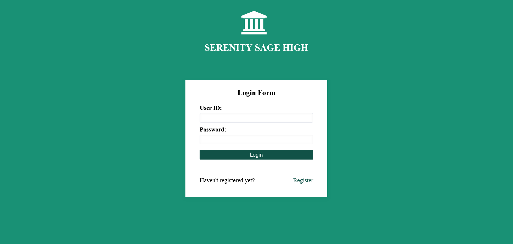
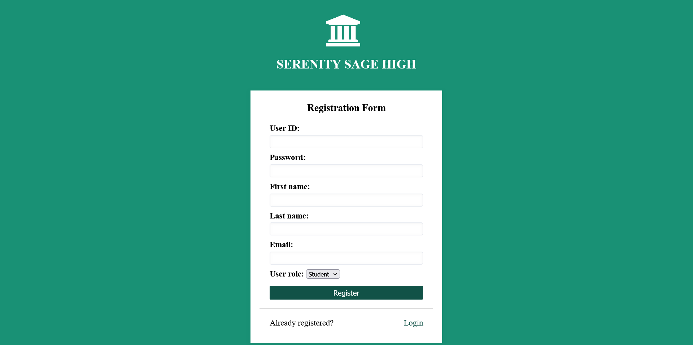
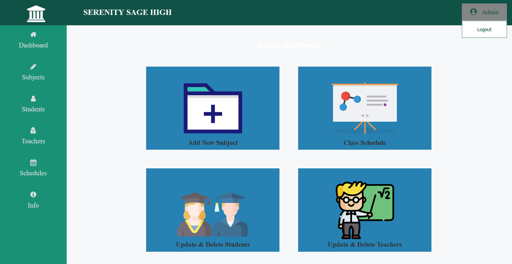
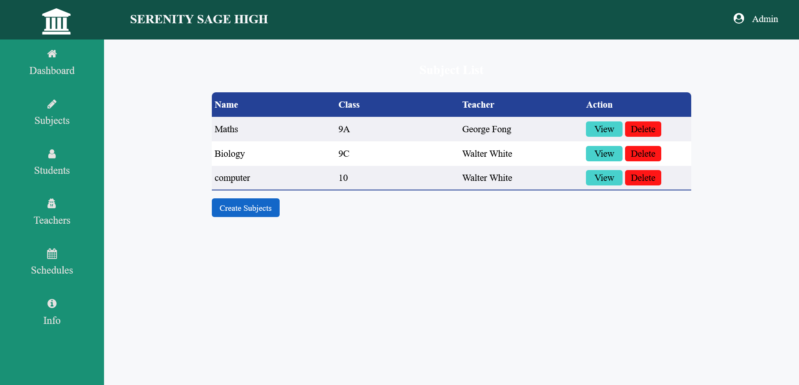
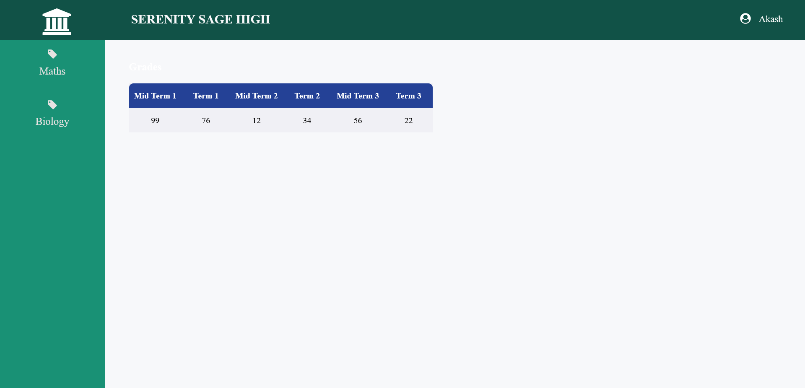

# Serenity Sage High School Management System

This project is a school management system designed for **Serenity Sage High**.

## Instructions

1. **Create a Database**:  
   In MySQL, create a new database named **`serenity_sage_high`**.

2. **Open the Project**:  
   Open the project in your preferred IDE (e.g., NetBeans, IntelliJ).

3. **Configure Application Properties**:  
   Update the **application.properties** file with the correct database configuration (e.g., database URL, username, password).

4. **Run the File**:  
   Once everything is configured, run the project to start the system.

---

## Credentials:

### Admin
- **Username**: `admin`
- **Password**: `1`

---

## Screenshots:

### 1. Login Page

  

---

### 2. Registeration Page

  

---

### 3. Admin Dashboard 

  
  

---

### 4. Student Dashboard

  

---

### 5. Teacher Dashboard

  

---
